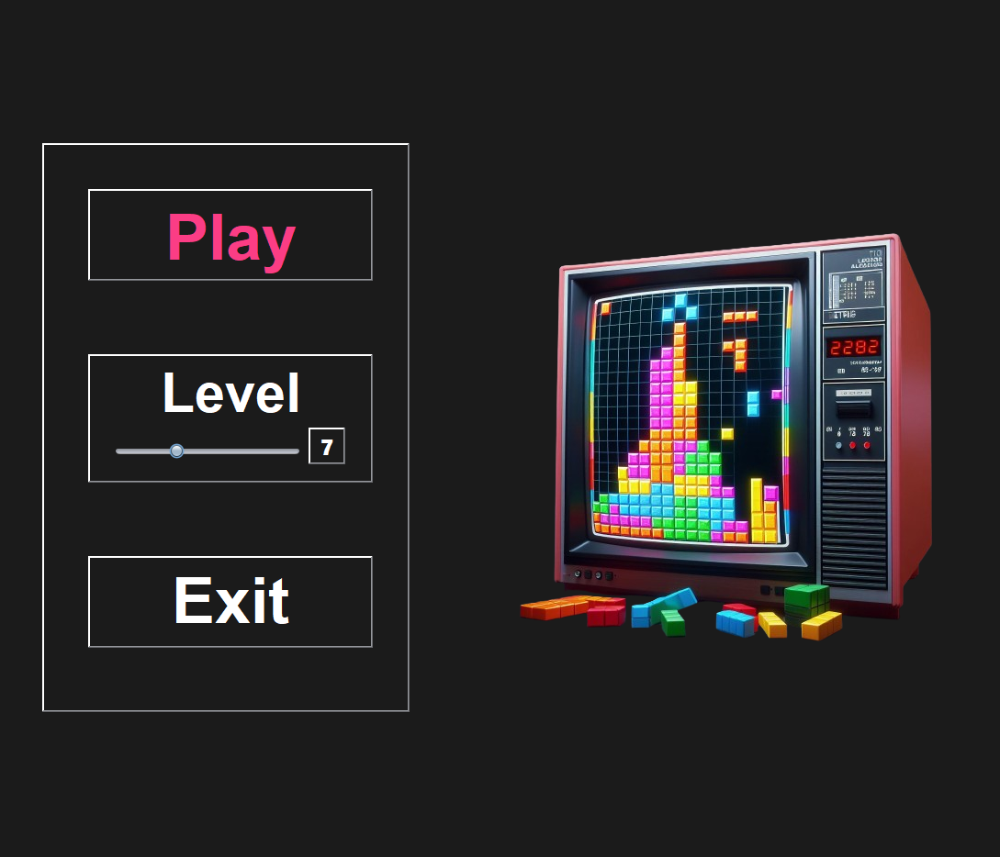
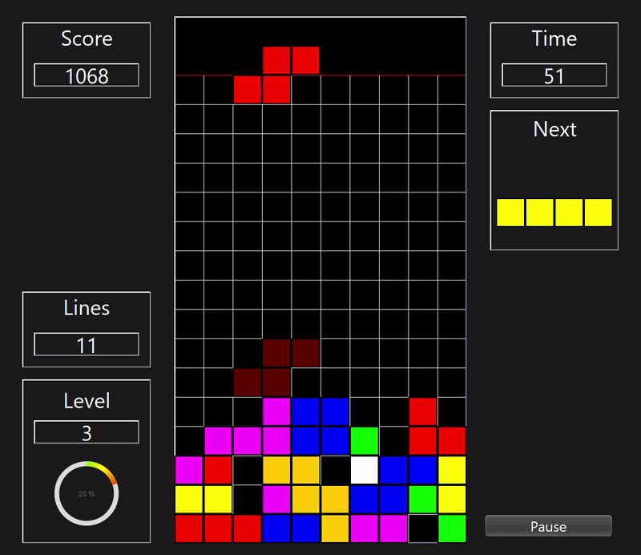

# Falling Blocks Game

## Description

This is a personal, non-commercial implementation inspired by the game Tetris, created in Java using Swing for the graphical user interface. The game features standard falling block gameplay with additional functionalities such as a countdown timer before the game starts, pause and resume capabilities, and score tracking.

## Features

- Standard falling block gameplay
- Ghost piece functionality to show where the piece will land
- Score tracking for lines cleared, soft drops, and level ups
- Pause and resume functionality
- Countdown timer before the game starts
- Game over screen with final score and stats

## Screenshots

<p align="center">
  
</p>

<p align="center">
  
</p>

## Getting Started

### Prerequisites

- Java Development Kit (JDK) 8 or later
- Git (for cloning the repository)

### Installation

1. Clone the repository:

```bash
git clone https://github.com/ThePandogs/falling-blocks-game.git
```

2. Compile the project and enjoy:
 ```bash
cd falling-blocks-game
#Linux
 .\buildWindows.sh
#Windows
 .\buildWindows.bat
```

### Usage
- Start Game: Launch the game and press the start button.
  
## Controls

The game controls are as follows:

- **Sideways Movement**: Use the left arrow (`←`) and right arrow (`→`) keys or the `A` and `D` keys.
  
- **Piece Rotation**: Press the up arrow (`↑`) key or the `W` key.
  
- **Fast Descent**: Press the down arrow (`↓`) key or the `S` key.
  
- **Drop to Bottom**: Press the space bar or the `P` key.
  
- **Pause**: Press the `P` key or `Esc` to pause the game.

## Attributions

### Music
- **Song:** Delighted by Roa
  - **Artist:** Roa
  - **Link:** [Soundcloud](https://soundcloud.com/roa_music1031/)
  - **License:** [Creative Commons CC BY 3.0](https://creativecommons.org/licenses/by/3.0/)
  - **Promoted by:** [Chosic](https://www.chosic.com/free-music/all/)
